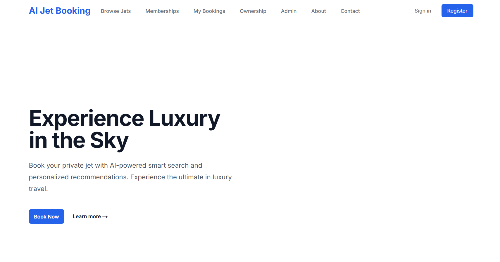
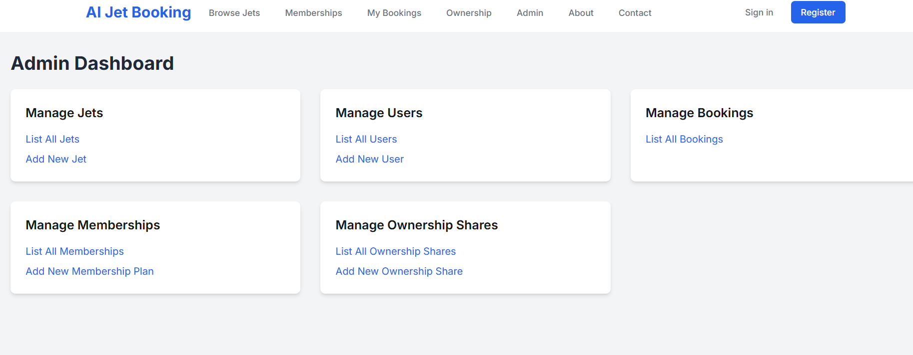
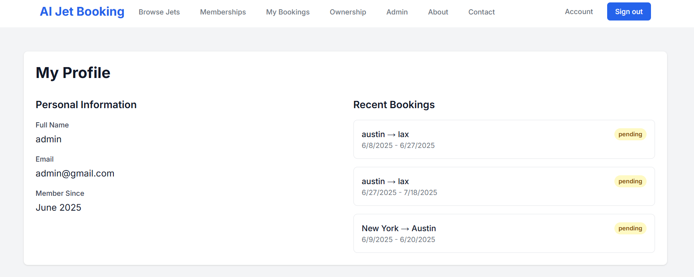
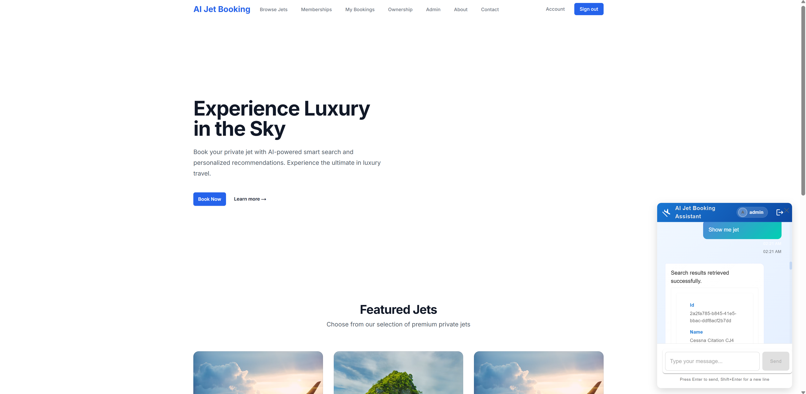
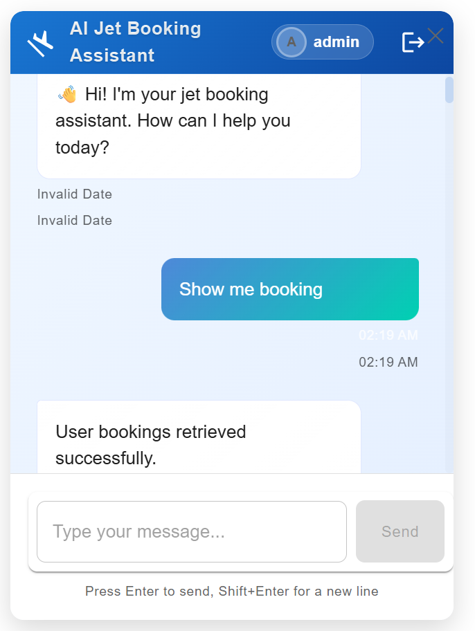

# 🛩️ AI-Powered Private Jet Booking MVP

A weekend-built proof-of-concept that combines traditional flight booking with conversational AI. The system allows users to search, book, and manage private jet travel using natural language, powered by a local LLM and Dust MCP agents.

## ⚙️ System Architecture

```
Frontend (Next.js + Tailwind CSS)
│
├── Login/Register, Dashboard, AI Chatbot
│
▼
BFF (API Layer - Node.js)
│
├── Auth Routes: /api/auth/*
├── Booking Routes: /api/bookings/*
├── MCP Proxy: /api/agent/chat
│
▼
Dust MCP Server (Local Node.js)
│
├── Agent: ai_concierge
├── Tools: searchJets, getBookingStatus, createBooking
│
▼
Local LLM (Ollama w/ Mistral or LM Studio)
```

## 🤖 AI, LLM & NLP Capabilities

### AI Chatbot (Frontend)
- Embedded in the UI as a persistent chat window
- Accepts natural language queries like:
  - "Book a light jet from Mumbai to Goa this Friday"
  - "Show me my last 3 bookings"
  - "Cancel my flight tomorrow at 9AM"
- Chat assistant performs:
  - Intent detection (via NLP)
  - Workflow orchestration (via MCP)
  - Context-aware follow-ups

### Local LLM (Ollama / LM Studio)
- Used for natural language understanding
- Runs fully offline, no external API keys
- Model: Mistral (via Ollama) or Phi-3 (via LM Studio)
- Default model: Mistral for general use, Phi-3 for specialized aviation queries
- Runs fully offline, no external API keys required

### Dust MCP Agent
- Agent: `ai_concierge`
- Tools:
  - `searchJets` — queries real-time or mock fleet data
  - `createBooking` — reserves flights
  - `getBookingStatus` — retrieves current status
  - `updateFleetJet` — admin-only, modify jet info
- Receives messages and decides which tool to call based on LLM-derived intent

## 🧩 Key Features

### User Functionality
- ✅ Login & registration (JWT-based)
- 📋 Booking dashboard showing current & past bookings
- 💬 AI-powered chat for:
  - Jet search and booking
  - Status lookup
  - Flight changes and cancellations

### Admin Functionality
- ✈️ Add/edit jets with NLP commands
- 🧾 Manage memberships & fractional shares
- 📊 Analytics and reporting


## 🗂️ Project Structure

```
ai-jet-booking/
├── frontend/                 # Next.js frontend application (Next.js 14 + TypeScript)
│   ├── src/
│   │   ├── app/             # App router directory
│   │   │   ├── (auth)/      # Authentication routes
│   │   │   ├── (dashboard)/ # Protected dashboard routes
│   │   │   ├── api/         # API routes
│   │   │   └── layout.tsx   # Root layout
│   │   ├── components/      # Reusable components
│   │   ├── lib/             # Utility functions
│   │   └── styles/          # Global styles
│   └── public/              # Static assets
│
├── backend/                # FastAPI backend
│   ├── app/
│   │   ├── api/           # API routes
│   │   ├── core/           # Core configurations
│   │   ├── models/         # Database models
│   │   ├── schemas/        # Pydantic schemas
│   │   └── services/       # Business logic
│   └── tests/              # Test suite
│
├── mcp-server/            # MCP Server (Node.js)
│   ├── src/
│   │   ├── agents/        # AI agents
│   │   │   └── ai_concierge/
│   │   │       ├── tools/    # Agent tools
│   │   │       └── index.ts # Agent configuration
│   │   ├── config/         # Configuration files
│   │   └── utils/          # Utility functions
│   └── package.json
│
├── jet-chat-ai/           # AI Chat Interface
│   ├── src/
│   │   ├── components/    # React components
│   │   ├── hooks/          # Custom hooks
│   │   └── services/       # API services
│   └── public/             # Static assets
│
├── .github/               # GitHub workflows
├── docker/                 # Docker configurations
└── docs/                   # Documentation
```
## 🎬 Example Workflow

1. User opens the chat interface
2. Enters: "show my bookingsr"
3. AI agent responds with list of jet bookings

## 🤖 Sample User Flows -in Progress

### Admin Workflow
1. Admin logs in
2. Uses chat to add new jet: "Add Falcon 900 jet with ID F-9001, seats 12, rate ₹130k/hr"
3. MCP confirms fleet addition

### Analytics Query
1. Admin types: "Show average hours used by Platinum members last 30 days"
2. Agent compiles report from DB and replies with summary

## 📬 Workflow Automation
- Email triggers for:
  - Booking confirmations
  - Membership renewals
  - Payment receipts
- Smart notifications using SMTP or SES via MCP orchestration

## 🛠 Tech Stack

- **Frontend**: Next.js, TypeScript, Tailwind CSS
- **Backend**: FastAPI, Python, SQLAlchemy
- **AI**: Local LLM (Mistral), Dust MCP
- **Database**: PostgreSQL
- **Auth**: JWT

## 📄 License

MIT - See [LICENSE](LICENSE) for more details.

## 🤖 AI & Automation

### Dust MCP
- **Agent**: `ai_concierge`
- **Tools**: 
  - `searchJets` - Find available jets based on criteria
  - `createBooking` - Create new flight bookings
  - `updateFleetJet` - Update jet fleet information
  - `getBookingStatus` - Check status of existing bookings
- **Function**: Routes user intent to appropriate tools and executes workflows.

### Local LLM Integration
- Powered by [Ollama](https://ollama.com) or LM Studio
- Natural language understanding for multi-turn conversations
- Context-aware responses to user queries


## Application Flow

### Frontend Flow
1. Entry Point: `frontend/src/app/page.tsx`
   - Renders home page
   - Provides navigation to other sections

2. Jet Listing: `frontend/src/app/jets/page.tsx`
   - Uses `JetCard` component to display jets
   - Implements `SearchFilters` for filtering
   - Calls `jetService` for data fetching

3. Jet Details: `frontend/src/app/jets/[id]/page.tsx`
   - Displays detailed jet information
   - Shows booking form
   - Uses `bookingService` for booking operations

### Backend Flow
1. Entry Point: `backend/main.py`
   - Initializes FastAPI application
   - Sets up middleware and routers
   - Configures event handlers

2. Request Flow:
   - Request → Router → CRUD Operation → Database
   - Response → Schema Validation → Client

3. Authentication Flow:
   - Request → Auth Router → Auth Utils → JWT Generation
   - Protected Routes → JWT Validation → User Verification

## Features

- Modern, responsive UI built with Next.js and Tailwind CSS
- Real-time jet availability and booking system
- Advanced search and filtering capabilities
- Secure authentication and authorization
- Detailed jet specifications and images
- Booking management system
- Admin dashboard for jet management

## Tech Stack

### Frontend
- Next.js 14
- TypeScript
- Tailwind CSS
- React Query
- Axios
- React Hook Form
- Zod

### Backend
- FastAPI
- PostgreSQL
- SQLAlchemy
- Alembic
- Pydantic
- Python 3.11+

## Getting Started

### Prerequisites
- Node.js 18+
- Python 3.11+
- PostgreSQL 15+

### Installation

1. Clone the repository:
```bash
git clone https://github.com/yourusername/ai-jet-booking.git
cd ai-jet-booking
```

2. Set up the backend:
```bash
# Create and activate virtual environment
python -m venv .venv
source .venv/bin/activate  # On Windows: .venv\Scripts\activate

# Install dependencies
cd backend
pip install -r requirements.txt

# Set up the database
./create_database.sh

# Run migrations
alembic upgrade head
```

3. Set up the frontend:
```bash
cd frontend
npm install
```

4. Start the development servers:
```bash
# From the root directory
./run_all.sh
```

The application will be available at:
- Frontend: http://localhost:3000
- Backend API: http://localhost:8000
- API Documentation: http://localhost:8000/docs

## Development

### MCP Server Setup
```bash
cd mcp-server

# Install dependencies
npm install

# Start development server
npm run dev


### Jet-Chat-AI Setup
```bash
cd jet-chat-ai

# Install dependencies
npm install

# Start development server
npm run dev


### Frontend Development
```bash
cd frontend

# Install dependencies
npm install

# Start development server
npm run dev


### Backend Development
```bash
cd backend

# Create and activate virtual environment
python -m venv venv
source venv/bin/activate  # Windows: .\venv\Scripts\activate

# Install dependencies
pip install -r requirements.txt

# Run database migrations
alembic upgrade head

# Start development server
uvicorn main:app --reload
```

## Testing

### Frontend Tests
```bash
cd frontend
npm test
```

### Backend Tests
```bash
cd backend
pytest
```


## Application UI

### Home Page


### Admin Dashboard


### User Account


### AI Chat - MCP

#### Show Me Jet



#### Show me my bookings


